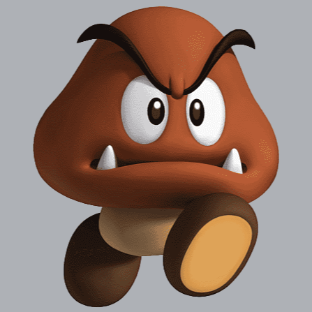
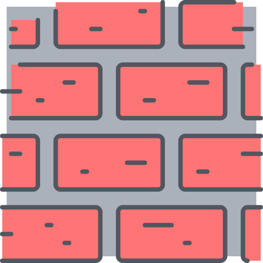

# Projet : Programmation Avancée
_Charlotte Kruzic & Zoé Marquis_

## Jeu du Casse-briques
Ce projet implémente un jeu du casse-briques classique avec plusieurs types de briques, des bonus et des malus.

---
## Briques
Le jeu comprend différents types de briques, chacune ayant une force différente :

- Brique bleu très clair : force 1
- Brique bleu clair  : force 2
- Brique bleu moyen : force 3
- Brique violette : force 4
- Brique violette foncée : force 5

Dans cette version du jeu, nous avons ajouté des briques Bonus/Malus. Ces briques spéciales sont masquées derrière une image, ce qui signifie que vous ne pouvez pas savoir à l'avance quels types de bonus  (ou vert foncé si le mode de jeu n'est pas celui avec des carrés)
 ou de malus  (ou rouge foncé si le mode de jeu n'est pas celui avec des carrés)
 se cachent derrière elles. Contrairement aux briques basiques, ces briques n'ont pas besoin d'être cassées pour remporter la partie.

### Briques Indestructibles
En plus des briques cassables, il existe des briques indestructibles, des murs 
 (ou marron si le mode de jeu n'est pas celui avec des carrés),  qui ajoutent de la complexité d'accès à certaines zones du jeu. Ces briques ne peuvent pas être détruites et ne contribuent pas à la victoire du joueur.

### Briques Bonus
- Décélérateur de la balle: Réduit (progressivement) la vitesse de la balle. Cette action s'applique à toutes les balles, même si elles ont des vitesses différentes dûes à leur moment de création (à l'initialisation d'une balle elle a une vitesse définie). Une vitesse minimale est définie.
- Agrandissement de la taille de la raquette : Augmente la taille de la raquette, permettant au joueur de couvrir une zone plus large du terrain de jeu.
  
### Briques Malus 
- Accélérateur de la balle: Augmente (progressivement) la vitesse de la balle. Cette action s'applique à toutes les balles, même si elles ont des vitesses différentes dûes à leur moment de création (à l'initialisation d'une balle elle a une vitesse définie). Une vitesse maximale est définie.
- Réduction de la taille de la raquette : Réduit la taille de la raquette, permettant au joueur de couvrir une zone plus restreinte du terrain de jeu.
  
--- 
## Bonus et Malus
Les bonus et les malus tombent du haut de la fenêtre, offrant une variété d'effets différents pour pimenter le jeu. Voici les différents types de bonus et de malus disponibles :

### Bonus
- Bleu Foncé : Décélérateur de la balle.
- Vert : Agrandissement de la taille de la raquette.
- Magenta : Multiballe - Génère 2 nouvelles balles pour des actions plus dynamiques.

### Malus 
- Jaune : Accélérateur de la balle.
- Rouge : Réduction de la taille de la raquette.

---
## Répartition des tâches

- Charlotte s'est occupée de la plateforme, de la balle, des collisions entre la plateforme, les briques et la balle, et en partie de la gestion de jeu. Elle a aussi réalisé les différentes formes pour Carré / Triangle / Hexagone.
  
- Zoé s'est occupée de la grille, des différentes briques (polymorphisme, CRTP), des différents bonus/malus ainsi que leurs interactions avec le reste du jeu. Elle a aussi réalisé la *"templatisation"* afin de pouvoir réaliser les différentes formes de grille.
  
----
## Énoncé : 
- [x] **une plateforme déplaçable au clavier ou à la souris**
- [x] **une balle qui rebondit en fonction de son angle d'impact**
- [x] **des briques de différents types avec différentes résistances**
- [x] **au moins trois types de bonus/malus dont le multi-balle**
- [x] **différentes grilles chargées depuis un fichier ASCII**
- [x] **supporter différentes formes de grilles de briques : hexagonales et triangulaires**
- [x] **Utilisez la STL au maximum  :**
  - [x] **Pas de tableau! des conteneurs STL**
  - [x] **Pas de pointeur! des unique/shared/weak_ptr**  
    Nous avons entrepris une optimisation des pointeurs "classiques", en remplaçant autant que possible ces derniers par des **unique_ptr**, **shared_ptr**, et **weak_ptr**. Cependant, **une** exception subsiste : l'objet *Game* doit continuer de créer et de superviser les *BonusMalus* (ainsi que les *SpecialBrick*).

    Les classes *BonusMalus* et *SpecialBrick* ont besoin de connaître l'instance de *Game* pour pouvoir effectuer diverses actions telles qu'accélérer/décélérer les balles, agrandir/rétrécir la raquette, ou encore créer de nouvelles balles. En résumé, elles gèrent toutes les interactions liées aux bonus et malus du jeu. Pour répondre à cette exigence, nous avons initialement utilisé un pointeur brut dans ces classes vers un objet *Game*, nécessaire lors de leur construction.

    Suite à une réflexion approfondie, nous sommes convaincus qu'il est préférable de remplacer ce pointeur brut par un weak_ptr. Cependant, en raison de contraintes de temps, nous n'avons pas encore réussi à implémenter cette solution de manière optimale.

    Vous pouvez néanmoins consulter le code associé dans la branche "test-weak-ptr", où la classe *Game* hérite de **`std::enable_shared_from_this<Game>`**. Dans cette implémentation, nous avons tenté de passer des weak_from_this() en tant qu'arguments aux constructeurs de *BonusMalus*. Bien que cette approche compile sans erreur, nous constatons malheureusement que la condition `if (auto game = game_.lock())` dans les différentes classes *BonusMalus* reste toujours fausse.
  - [x] **Utilisez les algorithmes de la STL**
- [x] **Écrivez des classes pour vos objets et encapsulez la SDL2**
- [x] **Utilisez de l'héritage et du polymorphisme**


- [x] **Soyez const-correct et efficaces, pas de copie inutile**  
    Nous pensons avoir essayé de le faire au maximum, mais par manque de temps il est possible qu'il y ait encore des choses à améliorer.

- [x] **Documentez votre code**  
    Nous avons utilisé *Doxygen*.
- [x] **Utilisez une convention de codage**  
     Nous avons utilisé la convention de codage "Google" utilisée avec l'outil de formatage de code *clang-format*. Nous avons écrit un maximum le code en anglais, les commentaires en français.

---
## Autres notions du cours utilisées
- **CRTP** : *SpecialBrick* utilise un modèle de programmation basé sur les templates, où il est spécialisé en fonction des classes dont il hérite, telles que *BonusBrick* et *MalusBrick*. Ces dernières possèdent chacune un attribut statique permettant de charger les images du jeu une seule fois pour les briques de forme carrée.
- **Mixin** : Les classes *SquareCell*, *TriangleCell* et *HexagonCell* partagent des fonctionnalités communes telles que les méthodes *draw* ou *getPoint*. Cela permet une réutilisation efficace du code et une gestion modulaire des fonctionnalités dans le jeu.

---
## Usage
```
mkdir build
cd build
cmake ..
make 
./project_programmation ../grilles/12345.txt
```

--- 
## todo 
- sdl_surface *
