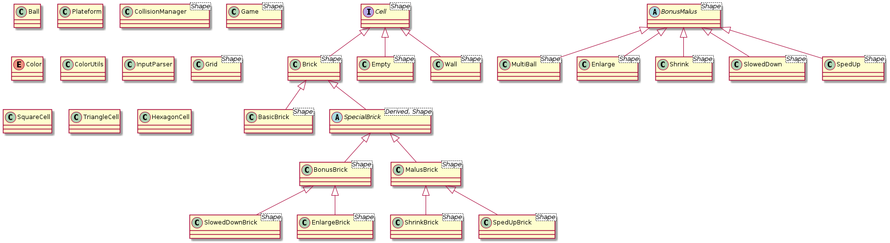
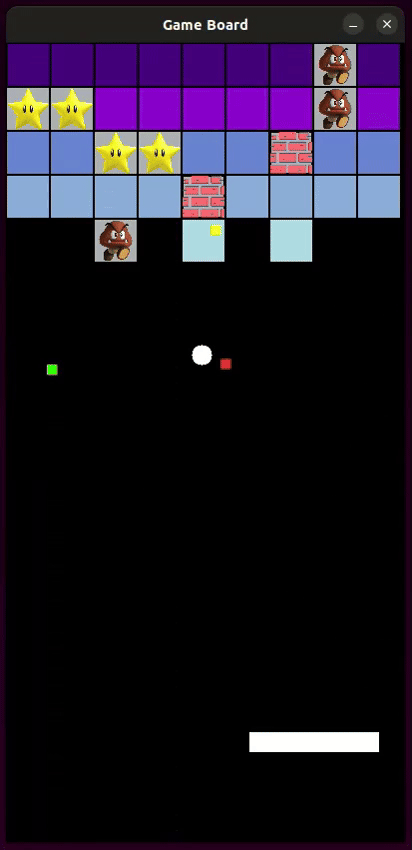

# Brick Breaker game
[](https://opensource.org/licenses/MIT)
## 🔎 Overview
A modern C++ take on the classic Brick Breaker game, built with SDL2. This project features multiple brick types, bonus/malus effects, and support for different grid shapes (square, triangular, and hexagonal).

## ⚙️ Features
- **Controllable platform** using keyboard or mouse
- Physics-based **ball movement** with accurate angle reflections
- Multiple **brick types** with varying resistance levels:
    - Light blue: strength 1
    - Blue: strength 2
    - Medium blue: strength 3
    - Purple: strength 4
    - Dark purple: strength 5
    - Special bonus/malus bricks
    - Indestructible wall bricks
- **Bonus/Malus effects** (some triggered by special bricks, others fall into the game window):
    - Ball deceleration (Dark Blue)
    - Platform enlargement (Green)
    - Multi-ball: generates 2 additional balls (Magenta)
    - Ball acceleration (Yellow)
    - Platform size reduction (Red)
- Different **grid layouts**:
    - Square grid
    - Triangular grid
    - Hexagonal grid
- ASCII file-based level loading system

## 👨🏻‍💻 Technical implementation
The game is built using modern C++ principles:
- Extensive use of STL containers and algorithms
- Smart pointers (unique_ptr, shared_ptr) instead of raw pointers
- Object-oriented design with inheritance and polymorphism
- Template-based programming with CRTP (Curiously Recurring Template Pattern)
- Mixin pattern for grid cell implementations
- Const-correctness and efficient memory management
- Clean code following Google's C++ style guide

## 📐 Class structure
The project uses a comprehensive class hierarchy:



## 📜 Requirements

- C++11 or higher
- SDL2
- SDL2_image
- SDL2_ttf

## 🚀 Compile & Run
1. Building the project
    ```bash
    mkdir build && cd build
    cmake ..
    make
    ```

2. Running the Game
    ```bash
    ./project_programmation ../grilles/all.txt
    ```
    Replace `all.txt` with any valid grid file from the `./grilles` directory.

## 🎮 Game controls
- Move platform: Mouse or arrow keys
- Pause/resume game: Spacebar or mouse click
- Quit game: Escape key

## 📸 Preview
<p align="center">
  
</p>

## 📝 Documentation
The code is fully documented using Doxygen comments and formatted according to Google's C++ style guide.

For more information about the purpose of this project, you can find the [complete project assignment file](./resources/project-assignment-fr.pdf) (in french) within this repository. This project was developed during the first year of the Master’s program in Data Science and Complex Systems at the University of Strasbourg. It is part of the common curriculum shared by all Computer Science tracks.

## 👷 Contributors
- Zoé Marquis
- Charlotte Kruzic